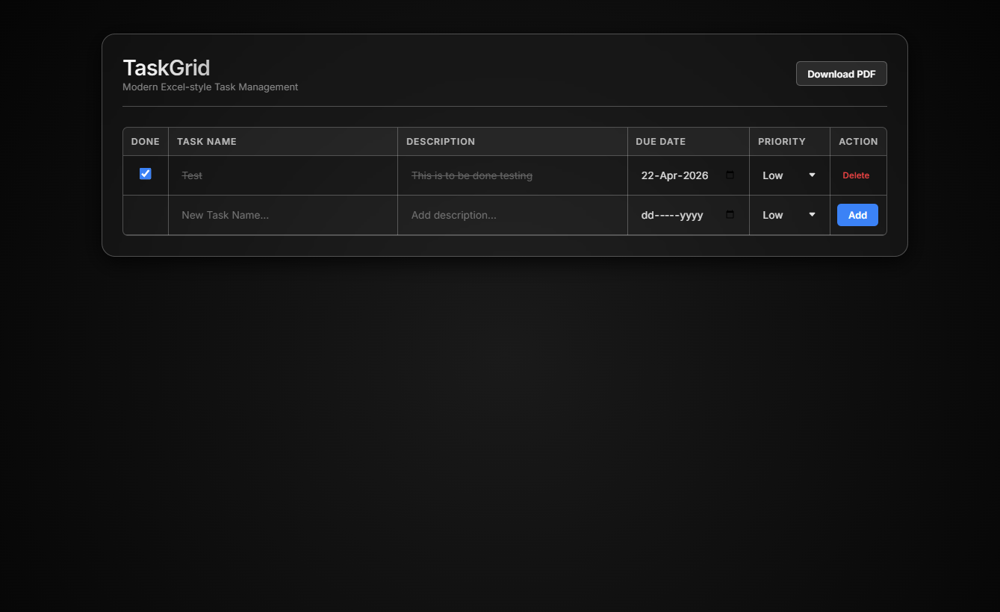

# TaskGrid - Modern Excel-Style Task Manager

TaskGrid is a sleek, modern, and highly functional task management application inspired by the efficiency of spreadsheets and the aesthetics of modern "Glassmorphism" design. Built for power users who prefer a grid-based interface, TaskGrid offers seamless task tracking with data persistence and professional reporting capabilities.



## ✨ Features

-   **💎 Glassmorphism Design:** A stunning dark-themed UI featuring semi-transparent surfaces, background blurs, and high-contrast borders.
-   **📊 Excel-Inspired Interface:** Manage your tasks in a familiar grid layout with inline editing for names, descriptions, dates, and priorities.
-   **💾 Local Persistence:** Your tasks are automatically saved to your browser's `localStorage`. No database setup or login required.
-   **📄 PDF Export:** Generate professional task reports instantly with the built-in PDF export feature powered by `jsPDF`.
-   **⚡ Rapid Entry:** Quickly add new tasks using the dedicated entry row at the bottom of the grid.
-   **📱 Responsive Layout:** Optimized for various screen sizes with a scrollable data container.

## 🚀 Getting Started

To get a local copy up and running, follow these simple steps:

1.  **Clone the Repository:**
    ```bash
    git clone https://github.com/rajjitlai/Task_Manager_Template.git
    ```
2.  **Open the Project:**
    Simply open `index.html` in your preferred web browser.

## 🛠️ Built With

-   **HTML5/CSS3:** Modern semantic structure and advanced CSS variables for glassmorphism.
-   **Vanilla JavaScript:** Lightweight and fast core logic.
-   **[jsPDF](https://github.com/parallax/jsPDF):** For client-side PDF generation.
-   **[jsPDF-AutoTable](https://github.com/simonbengtsson/jsPDF-AutoTable):** For table formatting in PDFs.
-   **Inter Font:** A clean, modern typeface from Google Fonts.

## 📜 License

Distributed under the MIT License. See `LICENSE` for more information.

---

Project Link: [https://github.com/rajjitlai/Task_Manager_Template](https://github.com/rajjitlai/Task_Manager_Template)
Created by **Rajjit Laishram**
